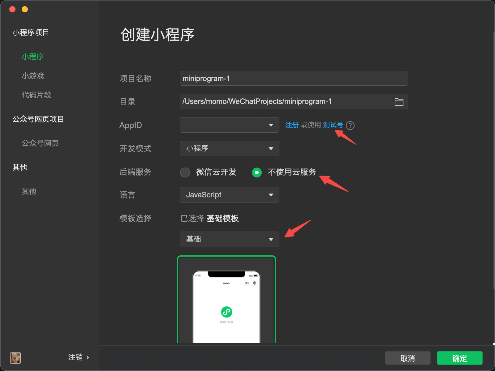

# 课程 1 <span style="margin-left: 32px;">*Hello World！*</span>

> 本系列课程只针对微信小程序开发，下文以及后续课程都用小程序作为简称，其他平台的小程序开发仅供参考

## 开发环境
- 操作系统 Windows ｜ MacOS
- 微信开发者工具 [下载地址](https://developers.weixin.qq.com/miniprogram/dev/devtools/download.html)
- 申请帐号并获取AppID [注册指引](https://developers.weixin.qq.com/miniprogram/dev/framework/quickstart/getstart.html#%E7%94%B3%E8%AF%B7%E5%B8%90%E5%8F%B7)
    - *申请帐号步骤当前并非是必要的，初期体验小程序开发可以使用官方提供的测试号AppID*
> 只要准备好上述的环境我们就可以直接来进行小程序的开发啦，非常简单！

***

## 新建项目
- 打开下载安装好的微信开发者工具
- 微信扫码登录
- 创建小程序项目



***

## 目录结构

```bash
.
├── pages
    .
    ├── index
        ├── index.js
        ├── index.json
        ├── index.wxml
        └── index.wxss
    .
.
├── app.js
├── app.json
├── app.wxss
├── project.config.json
.
```

> 小程序根目录下的 `app` 用来描述整体程序，`pages` 目录以及其内部的文件用来描述各自的页面，可以简单理解为 `app` 是小程序的主入口

***

### **前端三剑客** <span style="margin: 16px">*`html`*</span> <span style="margin: 16px">*`js`*</span> <span style="margin: 16px">*`css`*</span>
在小程序里三剑客演变成了 `wxml` `js` `wxss`，但本质没有改变：
> - wxml通过不同的标签来描述页面内容
> - wxss可以为页面编写丰富的样式
> - js最为核心，负责程序的逻辑

对照小程序的目录结构来看，无论是 `app` 还是 `page` 基本上也按照 `页面` `样式` `逻辑` 的组合来进行开发

### 配置（第四剑客）

除此之外小程序还增加了 **`配置`** 文件（xxx.json），可对小程序全局以及单独页面做配置，比如：导航栏背景颜色，窗口背景色，页面中使用了哪些组件等等...

***
**小程序**
|文件|作用|
|---|---|
|app.js|小程序主逻辑|
|app.json|全局配置|
|app.wxss|全局样式|

|字段|格式|作用|
|---|---|---|
|pages|string[]|页面申明|
|usingComponents|object|组件申明|
|window|object|窗口配置|
|tabBar|object|底部导航栏配置|

**页面**
|文件|作用|
|---|---|
|js|页面逻辑|
|json|页面配置|
|wxml|页面结构|
|wxss|页面样式|

> 描述页面的四个文件必须具有相同的路径与文件名

> 以本课程新建的demo项目举例，`index` 页面内的四个文件分别为 `index.js` `index.json` `index.wxml` `index.wxss`

|字段|格式|作用|
|---|---|---|
|usingComponents|object|组件申明|
|navigationBarTitleText|string|窗口标题|

**工具**
|文件|作用|
|---|---|
|project.config.json|开发者工具配置|

|字段|格式|作用|
|---|---|---|
|miniprogramRoot|string|指明小程序根目录|
|appid|string|小程序账号的唯一ID|

***

## 开发者工具
- 模拟器
- 编辑器
- 调试器

***

## 课后作业
- 申请自己的小程序账号，可以思考一下自己以后想做什么样的小程序，属于什么行业和类别，提供什么样的服务